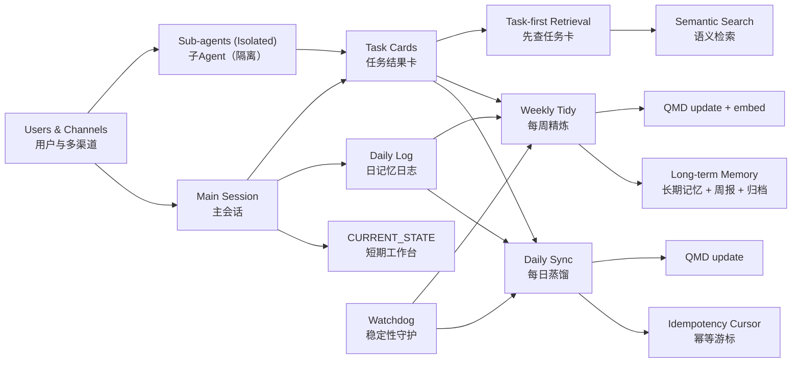

# openclaw-memory-final

Production-grade, open-source memory architecture for OpenClaw.

[中文文档 / Chinese Docs](README.zh-CN.md)

**AI-ready:** Yes. If a user only sends this repo link, use [`docs/ai-agent-prompt.md`](docs/ai-agent-prompt.md) for deterministic one-link bootstrap.

> This repository packages a practical memory system we run in production: incremental daily distillation, weekly consolidation, watchdog-based reliability, and QMD indexing.

**Short description:** A practical OpenClaw memory framework with daily sync, weekly tidy, and watchdog reliability.

## Prerequisites

- Node.js >= 22
- `qmd` CLI available in PATH (or pass `--qmd-path`)

Install QMD if missing:

```bash
npm install -g @tobilu/qmd
qmd --version
```

If your shell cannot find it, retry with absolute path:

```bash
bash scripts/install-ai.sh --tz Asia/Shanghai --qmd-path "$(command -v qmd)"
```

## AI-first Install (Recommended)

For agent-driven deployment, use one command:

```bash
bash scripts/install-ai.sh --tz Asia/Shanghai
```

- Success marker: `AI_INSTALL_OK`
- Failure marker: `AI_INSTALL_ERROR <reason>`
- If `AI_INSTALL_ERROR qmd_not_found`: install QMD first (`npm install -g @tobilu/qmd`) or rerun with `--qmd-path /absolute/path/to/qmd`
- On success, it prints a JSON report (jobs, ids, next runs, qmd path, state files).

### OpenClaw one-link usage

If a user only sends this repository link to OpenClaw, the agent should follow:
- [`docs/ai-agent-prompt.md`](docs/ai-agent-prompt.md)

This one-link flow is expected to be immediately usable without manual file copying.

See deterministic prompt: [`docs/ai-agent-prompt.md`](docs/ai-agent-prompt.md)

## Architecture Diagram


```mermaid
flowchart LR
  U["Users & Channels<br/>用户与多渠道"] --> M["Main Session<br/>主会话"]
  U --> SA["Sub-agents (Isolated)<br/>子Agent（隔离）"]

  M --> CS["CURRENT_STATE<br/>短期工作台"]
  M --> DL["Daily Log<br/>日记忆日志"]
  M --> TC["Task Cards<br/>任务结果卡"]
  SA --> TC

  DL --> SYNC["Daily Sync<br/>每日蒸馏"]
  TC --> SYNC
  SYNC --> CUR["Idempotency Cursor<br/>幂等游标"]

  DL --> TIDY["Weekly Tidy<br/>每周精炼"]
  TC --> TIDY
  TIDY --> LM["Long-term Memory<br/>长期记忆 + 周报 + 归档"]

  TC --> RET["Task-first Retrieval<br/>先查任务卡"]
  RET --> SEM["Semantic Search<br/>语义检索"]

  SYNC --> Q1["QMD update"]
  TIDY --> Q2["QMD update + embed"]

  WD["Watchdog<br/>稳定性守护"] --> SYNC
  WD --> TIDY
```

Detailed view: [`docs/architecture.md`](docs/architecture.md)

## Highlights

- **Layered memory pipeline**: short-term workspace + daily sync + weekly tidy + watchdog
- **Sub-agent task memory index**: result-only task cards in `memory/tasks/`
- **MVP baseline included**: `CURRENT_STATE` / `memory/INDEX` templates + helper scripts (`mem-log.sh`, `memory-reflect.sh`)
- **Idempotent capture**: message fingerprint cursor (`processed-sessions.json`)
- **Low-noise alerting**: alert only after **2 consecutive anomalies**
- **Cost-aware indexing**: daily `qmd update`, weekly `qmd update && qmd embed`
- **Context budget guard (new)**: hard caps for per-file and total injected memory chars
- **Dynamic profile injection (new)**: profile-based minimal context packs (`main/ops/btc/quant`)
- **Conflict detection (new)**: scan durable memory for routing/rule drift before persisting changes
- **Retrieval watchdog + nightly maintenance (new)**: 30-min health checks + nightly `qmd update`/conditional `embed`
- **Open-source ready**: docs, scripts, templates, CI, contribution policy

## Architecture (at a glance)

1. **Multi-agent memory handoff**
   - Main session curates durable memory.
   - Sub-agents keep raw execution in isolated history.
   - Handoff format is result-only task cards in `memory/tasks/YYYY-MM-DD.md`.
2. **Daily Sync** (`memory-sync-daily`, 23:00 local time)
   - Distill only new conversations from the last 26h
   - Append structured notes to `memory/YYYY-MM-DD.md`
   - Write sub-agent result cards to `memory/tasks/YYYY-MM-DD.md`
3. **Weekly Tidy** (`memory-weekly-tidy`, Sunday 22:00)
   - Consolidate and prune `MEMORY.md`
   - Generate weekly summary and archive old daily logs
4. **Watchdog** (`memory-cron-watchdog`, every 2h at :15)
   - Checks stale/error/disabled state
   - Alerts only when anomaly repeats twice
5. **Retrieval watchdog** (`memory-retrieval-watchdog-v1`, every 30m)
   - Runs retrieval health checks and confirms anomalies with 2-hit logic
6. **Nightly QMD maintenance** (`memory-qmd-nightly-maintain`, daily 03:20)
   - Runs `qmd update`; runs `qmd embed` only when pending backlog exceeds threshold
7. **Context budget + dynamic profile pack**
   - Hard limits for injected context size, profile-based minimal inclusion

See full design: [`docs/architecture.md`](docs/architecture.md)

## Quick Start

```bash
bash scripts/install-ai.sh --tz Asia/Shanghai
```

Then:
1. Merge `examples/AGENTS-memory-section.md` into your `~/.openclaw/workspace/AGENTS.md`
2. (Optional) Merge `examples/openclaw-memory-config.patch.json` into `~/.openclaw/openclaw.json` (patch semantics, no full overwrite)
3. Restart gateway

> `scripts/install-ai.sh` automatically bootstraps baseline files into workspace:
> - `memory/CURRENT_STATE.md`
> - `memory/INDEX.md`
> - `memory/context-profiles.json`
> - `scripts/mem-log.sh`
> - `scripts/memory-reflect.sh`
> - `scripts/memory_context_budget_guard.py`
> - `scripts/memory_context_pack.py`
> - `scripts/memory_conflict_check.py`
> - `scripts/memory_retrieval_watchdog.py`

```bash
openclaw gateway restart
```

### Post-install verification (required)

```bash
openclaw cron list
ls -l ~/.openclaw/workspace/memory/state/processed-sessions.json
ls -l ~/.openclaw/workspace/memory/state/memory-watchdog-state.json
ls -l ~/.openclaw/workspace/memory/CURRENT_STATE.md ~/.openclaw/workspace/memory/INDEX.md
ls -l ~/.openclaw/workspace/scripts/mem-log.sh ~/.openclaw/workspace/scripts/memory-reflect.sh
ls -l ~/.openclaw/workspace/memory/context-profiles.json
ls -l ~/.openclaw/workspace/scripts/memory_context_budget_guard.py ~/.openclaw/workspace/scripts/memory_context_pack.py ~/.openclaw/workspace/scripts/memory_conflict_check.py ~/.openclaw/workspace/scripts/memory_retrieval_watchdog.py
python3 ~/.openclaw/workspace/scripts/memory_context_budget_guard.py --profile main
```

Expected cron names:
- `memory-sync-daily`
- `memory-weekly-tidy`
- `memory-cron-watchdog`
- `memory-retrieval-watchdog-v1`
- `memory-qmd-nightly-maintain`

## Optional: Install AI-friendly workspace skills pack

If you want deterministic behavior for memory/cron/release workflows, install the bundled skills from [`examples/skills/`](examples/skills/).

### One-command installer (recommended)

```bash
bash scripts/install-skills-pack.sh
```

### Manual install

```bash
mkdir -p ~/.openclaw/workspace/skills
cd ~/.openclaw/workspace/skills
tar -xzf <path-to>/openclaw-skills-pack-v2026-02-25.tar.gz
openclaw skills list --eligible
```

Included skills:
- `memory-task-card`
- `cron-doctor`
- `long-task-async`
- `github-release-flow`
- `heartbeat-ops-check`
- `trading-stack-autorepair`

Notes:
- Start a **new session** after install (skills are snapshotted per session).
- Workspace skills take precedence over bundled/managed skills.

## Safe Deployment Notes

- `scripts/setup.sh` only manages `memory-*` cron jobs and memory-related state/helper files.
- Existing memory jobs are kept by default. Use `--force-recreate` only when you really need replacement.
- Avoid full `config.apply` with snippets. Use `config.patch` semantics for memory config.
- If gateway behaves abnormally after deployment, follow [`docs/troubleshooting-gateway.md`](docs/troubleshooting-gateway.md).

## Retrieval Order (recommended)

1. Check `memory/tasks/*.md` for task outcomes
2. Then use semantic memory search
3. Drill into raw sub-agent session history only when necessary

## Repository Layout

```text
.github/                # CI, issue templates, PR template
scripts/                # setup/uninstall/validate
examples/               # config and template files
docs/                   # architecture/ops/prompts/migration
```

## Versioning

This project follows **Semantic Versioning**.

## License

MIT — see [`LICENSE`](LICENSE).

