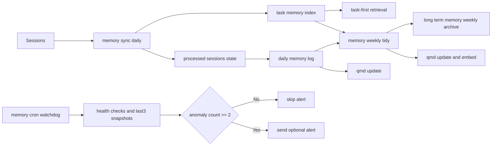

# openclaw-memory-final

Production-grade, open-source memory architecture for OpenClaw.

[中文文档 / Chinese Docs](README.zh-CN.md)

**AI-ready:** Yes. If a user only sends this repo link, use [`docs/ai-agent-prompt.md`](docs/ai-agent-prompt.md) for deterministic one-link bootstrap.

> This repository packages a practical memory system we run in production: incremental daily distillation, weekly consolidation, watchdog-based reliability, and QMD indexing.

**Short description:** A practical OpenClaw memory framework with daily sync, weekly tidy, and watchdog reliability.

## AI-first Install (Recommended)

For agent-driven deployment, use one command:

```bash
bash scripts/install-ai.sh --tz Asia/Shanghai
```

- Success marker: `AI_INSTALL_OK`
- Failure marker: `AI_INSTALL_ERROR <reason>`
- On success, it prints a JSON report (jobs, ids, next runs, qmd path, state files).

See deterministic prompt: [`docs/ai-agent-prompt.md`](docs/ai-agent-prompt.md)

## Architecture Diagram



Detailed view: [`docs/architecture.md`](docs/architecture.md)

## Highlights

- **Layered memory pipeline**: daily sync + weekly tidy + watchdog
- **Sub-agent task memory index**: result-only task cards in `memory/tasks/`
- **Idempotent capture**: message fingerprint cursor (`processed-sessions.json`)
- **Low-noise alerting**: alert only after **2 consecutive anomalies**
- **Cost-aware indexing**: daily `qmd update`, weekly `qmd update && qmd embed`
- **Open-source ready**: docs, scripts, templates, CI, contribution policy

## Architecture (at a glance)

1. **Daily Sync** (`memory-sync-daily`, 23:00 local time)
   - Distill only new conversations from the last 26h
   - Append structured notes to `memory/YYYY-MM-DD.md`
   - Write sub-agent result cards to `memory/tasks/YYYY-MM-DD.md`
2. **Weekly Tidy** (`memory-weekly-tidy`, Sunday 22:00)
   - Consolidate and prune `MEMORY.md`
   - Generate weekly summary and archive old daily logs
3. **Watchdog** (`memory-cron-watchdog`, every 2h at :15)
   - Checks stale/error/disabled state
   - Alerts only when anomaly repeats twice

See full design: [`docs/architecture.md`](docs/architecture.md)

## Quick Start

```bash
bash scripts/install-ai.sh --tz Asia/Shanghai
```

Then:
1. Merge `examples/AGENTS-memory-section.md` into your `~/.openclaw/workspace/AGENTS.md`
2. Merge `examples/openclaw-memory-config.patch.json` into `~/.openclaw/openclaw.json`
3. Restart gateway

```bash
openclaw gateway restart
```

## Optional: Install AI-friendly workspace skills pack

If you want deterministic behavior for memory/cron/release workflows, install the bundled skills from [`examples/skills/`](examples/skills/):

```bash
mkdir -p ~/.openclaw/workspace/skills
cd ~/.openclaw/workspace/skills
tar -xzf <path-to>/openclaw-skills-pack-v2026-02-25.tar.gz
openclaw skills list --eligible
```

Included skills:
- `memory-task-card`
- `cron-doctor`
- `long-task-async`
- `github-release-flow`
- `heartbeat-ops-check`
- `trading-stack-autorepair`

Notes:
- Start a **new session** after install (skills are snapshotted per session).
- Workspace skills take precedence over bundled/managed skills.

## Safe Deployment Notes

- `scripts/setup.sh` only manages `memory-*` cron jobs and state files.
- Existing memory jobs are kept by default. Use `--force-recreate` only when you really need replacement.
- Avoid full `config.apply` with snippets. Use `config.patch` semantics for memory config.
- If gateway behaves abnormally after deployment, follow [`docs/troubleshooting-gateway.md`](docs/troubleshooting-gateway.md).

## Retrieval Order (recommended)

1. Check `memory/tasks/*.md` for task outcomes
2. Then use semantic memory search
3. Drill into raw sub-agent session history only when necessary

## Repository Layout

```text
.github/                # CI, issue templates, PR template
scripts/                # setup/uninstall/validate
examples/               # config and template files
docs/                   # architecture/ops/prompts/migration
```

## Versioning

This project follows **Semantic Versioning**.

## License

MIT — see [`LICENSE`](LICENSE).

