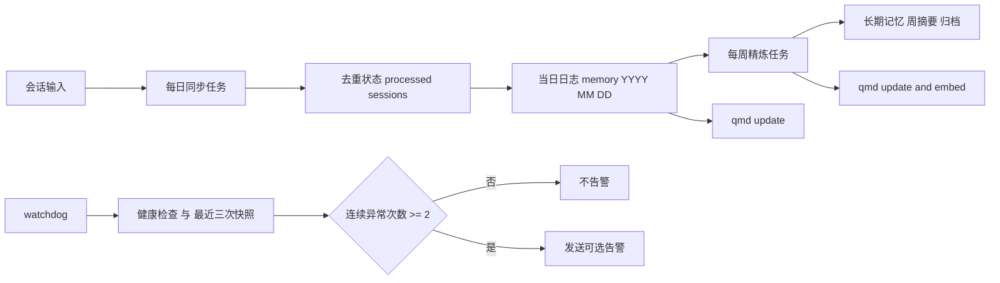

# openclaw-memory-final

面向生产环境的 OpenClaw 记忆架构（开源版）。

> 本仓库沉淀了我们在线上使用的记忆方案：**日增量蒸馏 + 周度精炼归档 + watchdog 稳定性守护 + QMD 检索索引**。

**AI 直链可部署：**可以。仅给仓库链接时，建议直接使用 [`docs/ai-agent-prompt.md`](docs/ai-agent-prompt.md) 这份标准提示词完成确定性落地。

## AI 优先安装（推荐）

面向 Agent 部署，建议直接使用单命令：

```bash
bash scripts/install-ai.sh --tz Asia/Shanghai
```

- 成功标记：`AI_INSTALL_OK`
- 失败标记：`AI_INSTALL_ERROR <reason>`
- 成功后会输出 JSON 报告（任务名/id/下次运行/QMD 路径/状态文件）。

标准提示词见：[`docs/ai-agent-prompt.md`](docs/ai-agent-prompt.md)

## 架构图



详版见：[`docs/architecture.md`](docs/architecture.md)

## 亮点

- **分层记忆流水线**：`daily sync + weekly tidy + watchdog`
- **幂等写入**：基于消息指纹游标（`processed-sessions.json`）
- **低噪告警**：同类异常需连续 2 次才告警
- **成本可控**：日常仅 `qmd update`，周任务执行 `qmd update && qmd embed`
- **开源标准完备**：文档、脚本、模板、CI、贡献规范齐全

## 架构概览

1. **Daily Sync**（`memory-sync-daily`，本地时间 23:00）
   - 仅处理最近 26 小时内的新增有效会话
   - 结构化追加到 `memory/YYYY-MM-DD.md`
2. **Weekly Tidy**（`memory-weekly-tidy`，每周日 22:00）
   - 精炼并裁剪 `MEMORY.md`
   - 生成周摘要并归档过期 daily 日志
3. **Watchdog**（`memory-cron-watchdog`，每 2 小时在 :15 执行）
   - 监控 stale / error / disabled 状态
   - 仅在异常重复出现时告警

完整设计见：[`docs/architecture.md`](docs/architecture.md)

## 快速开始

```bash
bash scripts/install-ai.sh --tz Asia/Shanghai
```

完成安装后，请继续：

1. 合并 `examples/AGENTS-memory-section.md` 到 `~/.openclaw/workspace/AGENTS.md`
2. （可选）按 patch 方式应用 `examples/openclaw-memory-config.patch.json`，不要整文件覆盖配置
3. 重启 gateway：

```bash
openclaw gateway restart
```


## 安全部署说明

- `scripts/setup.sh` 只管理 `memory-*` 三个 cron 和状态文件。
- 默认保留已存在任务；仅在必要时使用 `--force-recreate` 覆盖。
- 请勿把配置片段直接做全量 `config.apply`；应使用 patch 语义。
- 若部署后 gateway 异常，按 [`docs/troubleshooting-gateway.md`](docs/troubleshooting-gateway.md) 排查。

## 仓库结构

```text
.github/                # CI、Issue 模板、PR 模板
scripts/                # setup / uninstall / validate
examples/               # 配置样例与模板
docs/                   # 架构、提示词、迁移、运维文档
```

## 版本策略

本项目遵循 **Semantic Versioning**（语义化版本）。

## 许可证

MIT，详见 [`LICENSE`](LICENSE)。

## 英文说明

English README: [`README.md`](README.md)
